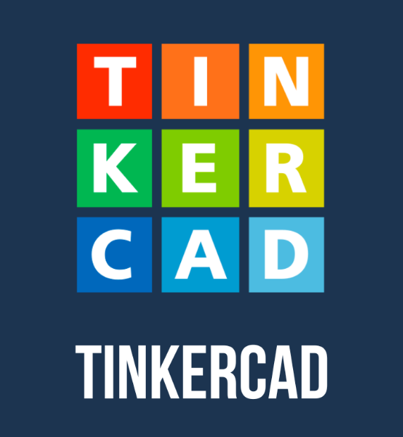

<h align="right">  </h>
<h1 align="center"> 👋 Hello, I'm MD Dulal Hossain </h1>
<h1 align="center">
    
</h1>

<!-- banner images ends here I'm+student+👨‍🎓!;+I'm+Mentor+👨‍⚖️!;+I'm+Coching Teacher+👨‍🏫!;+I'm+Tutor+👩‍🏫!;+I'm+Class Representative+👨‍✈️!;" /> 
Hi+There!+👋;+I'm+Pedro+Muniz!;+I'm+Pedro+Muniz!;+I'm+Pedro+Muniz!;+I'm+Pedro+Muniz!;" />
-->

🏠 &nbsp; Living: Dhaka , Bangladesh

<h3 align="left">Connect with me:</h3>

<!-- Contact me section starts here  -->

[][website]
[][youtube]
[][facebook]
[][linkedin]
[][github]
[][tinkercad]
[][protfolio]

 
 

<!-- Contact me section ends here 

   
 
<h align="left">  </h>

 -->
<!-- 
  

-->

  <h2>🐍 My Contributions 🐍</h2>
   
  
  
     

<!-- about-me section starts here  -->

<h2> 👨‍🏫  About Me </h2>

I am a Computer Science and Engineering student at Green University of Bangladesh.
My experience includes roles as a Home Tutor, Class Representative, and former volunteer with Bangladesh Scouts. 
I am proficient in programming languages like Python, Java, and C++, and experienced in Agile and Scrum methodologies.
My projects showcase skills in developing a Desktop Voice Assistant, E-commerce Website, and Banking System.
Awarded ‘Best Volunteer’ and recognized in sports, I am passionate about creating innovative solutions and working
collaboratively. For more details, contact Dr. Muhammad Aminur Rahaman, Chairperson of CSE at Green University.

- 🌱 I’m currently learning **JavaScript**

- 👨‍💻 All of my projects are available at [https://github.com/Dulal-CSEcode]

- 💬 Ask me about **Html CSS Python PHP Mysql**

- 📫 How to reach me **dulal.md.cse@gmail.com**

- ⚡ Fun fact **I think i am Funny**

 

<h2 align="center">⚡ Stats ⚡</h2>
 

  
  
   
  

  

 

<!--

&nbsp;

 about-me section ends here  -->

<!--
**Dulal-CSEcode/Dulal-CSEcode** is a ✨ _special_ ✨ repository because its `README.md` (this file) appears on your GitHub profile.

Here are some ideas to get you started:

- 🔭 I’m currently working on ...
- 🌱 I’m currently learning ...
- 👯 I’m looking to collaborate on ...
- 🤔 I’m looking for help with ...
- 💬 Ask me about ...
- 📫 How to reach me: ...
- 😄 Pronouns: ...
- ⚡ Fun fact: ...
-->
<!-- other skills and my videos for computer science section starts here  -->
<h2> Programing Languages</h2> 
<!-- Frontend -->

 
 

<h2> Frameworks </h2> 

 
 

<h2> Tools </h2> 

<!-- Development Tools -->

<!-- work experience section starts here  -->

 
 

<h2> 💼  Employment History </h2>

|      Position       |                   Institute                 |       Duration      |                Location               |
| ------------------- | ------------------------------------------- | ------------------- | ------------------------------------- |
| Class Representative| Green University of Bangladesh (GUB)        | Aug 2021 – Running  | Purbachal American City, Kanchon 1460 |
| Home Tutor (E.M.)   | Oxford International School( Student )      | May 2019 - Running  | Bata Goli, Dhaka 1205                 |
| Content Creator     | YouTube                                     | Jan 2023- Running   | USA                                   |

 
<!-- work experience section ends here  -->
<!-- education section starts here  -->

<h2> 👨🏻‍🎓  Education </h2>

<h3> 1. B.Sc. in Computer Science & Engineering </h3>

      Green University of Bangladesh
      Purbachal American City, Kanchon 1460 , Dhaka , Bangladesh .
      August 2021 – Continue
         ▪ Class Representative
   
<h3> 2. Higher Secondary School Certificate (HSC) </h3>
   
      Moulana Saifuddin Ahiya Degree College
      Shahzadpur, Sirajgonj . 
      July 2017 – May 2020  
            ▪ Bangladesh Scouts
            ▪ Event Volunteer
            ▪ Class Representative
<h3> 3. Secondary School Certificate (SSC) </h3>

      Jamirata High School  
      Jamirata, Shahzadpur, Sirajgonj. 
      January 2012 – May 2017 
         ▪ Bangladesh Scouts
         ▪ Event Volunteer
         ▪ Class Captain

 

<!-- education section ends here  -->

<!-- my languages section starts here  -->

<h2> Languages: </h2>

-  Bangla     : Native
-  English    : Intermediate
-  Hindi      : Intermediate
   

<!-- my languages section ends here  -->

<!-- my sports and game section starts here  -->

<h2> Sports / Game / Activities / Hobby: </h2>

- 🏏 Cricket, ⚽ Football, 🏸 Badminton, ♟️ Chess, 🏐 Volleyball
- 🏊‍♂️ Swimming, 🏃‍♂️ Running, 🚶‍♂️ Walking, 🚴‍♂️ Cycling, 🚘Driving
- ✈️ Travelling

 
<!-- my sports and games section ends here  -->

<!-- Honors & awards section starts here  -->

<h2> 🏅 Honors & Awards : </h2>

- Champion - Badminton Tournament Shahzadpur Upazila Sirajgonj ( 2018 ).
- Runner up - Badminton Tournament Rajshahi ( 2019 ).
---

Thanks for going through my Portfolio.
All rights reserved by Dulal-CSEcode @2024
---

<!-- my achievement section ends here  -->

<!-- Links section starts here -->

[youtube]: https://youtube.com/@dulal-csecode?si=ZCehq0D1Ijm0la6N
[facebook]: https://www.facebook.com/md.dulalhossain.735944?mibextid=ZbWKwL
[linkedin]: https://www.linkedin.com/in/md-dulal-hossain-42b476238/
[github]: https://github.com/Dulal-CSEcode
[tinkercad]: https://www.tinkercad.com/dashboard
[website]: https://md-dulal-hossain-protfolio.netlify.ap/
[protfolio]: https://md-dulal-hossain-protfolio.netlify.ap/
<!-- Links section ends here -->
