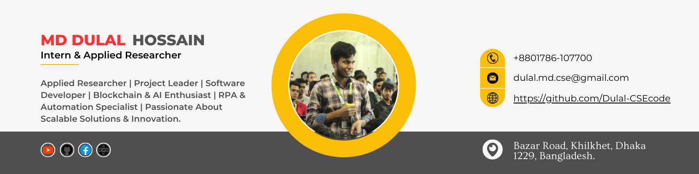
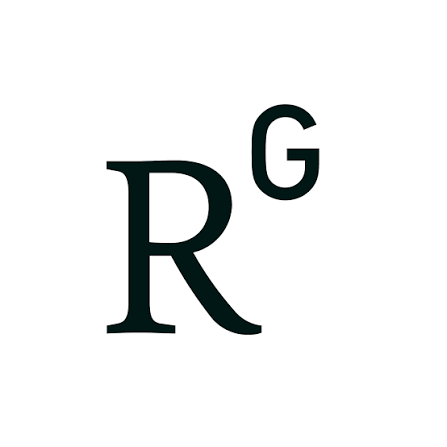
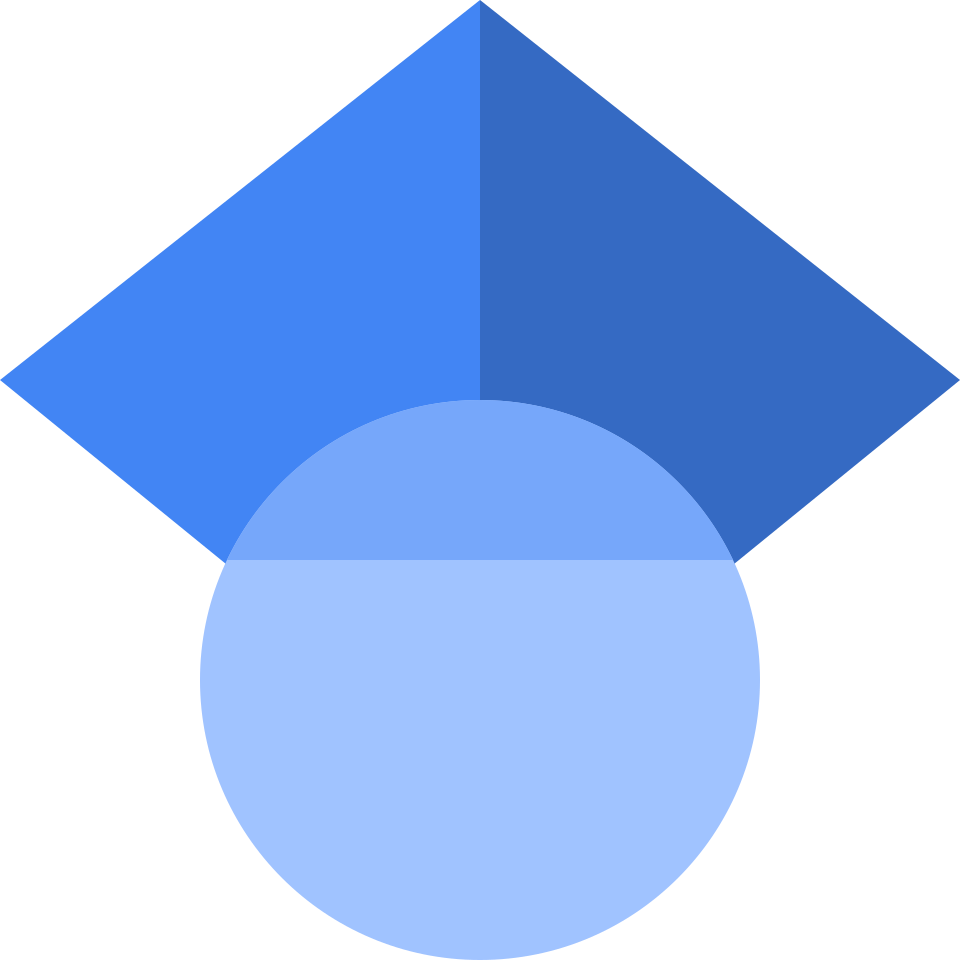
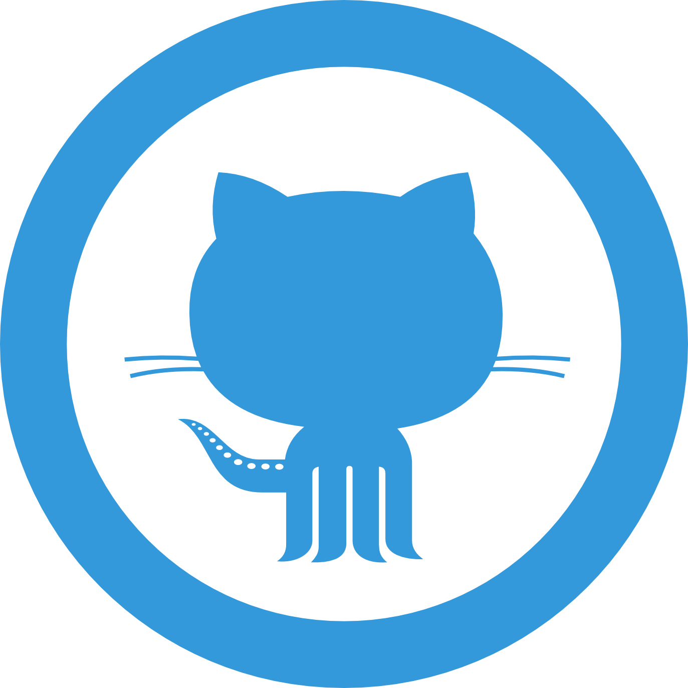
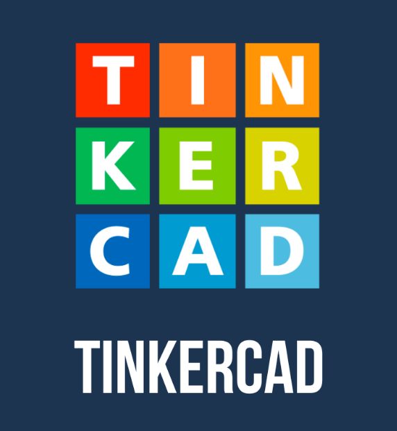

<!-- banner image starts here  -->

<!-- banner image ends here  -->

<h align="right"> 
 
</h>

<!--

  

<!-- Visitor Counter - WORKING VERSION 

 
  

 
-->

<h1 align="center"> 👋 Hello, I'm MD Dulal Hossain </h1>
<h1 align="center">
   <!-- 
  
-->

<!-- 

-->

  
</h1>
  
  

| Officer | Teaching Assistant | Academic Assistant | Project Developer | Software Developer | Blockchain & AI Enthusiast | RPA & Automation Specialist | Passionate About Scalable Solutions | Innovation | Student at Jagannath University | Alumnus at Green University of Bangladesh |.

<!-- banner images ends here I'm+student+👨‍🎓!;+I'm+Mentor+👨‍⚖️!;+I'm+Coching Teacher+👨‍🏫!;+I'm+Tutor+👩‍🏫!;+I'm+Class Representative+👨‍✈️!;" /> 
Hi+There!+👋;+I'm+Pedro+Muniz!;+I'm+Pedro+Muniz!;+I'm+Pedro+Muniz!;+I'm+Pedro+Muniz!;" />
-->

🏠 &nbsp; Living: Dhaka , Bangladesh

<h3 align="left">Connect with me:</h3>

<!-- Contact me section starts here  -->

[][website]
[][youtube]
[][orcid]
[][researchgate]
[][googlescholar]
[][facebook]
[][linkedin]
[][github]
[][tinkercad]
[][protfolio]

 
 

<!-- Contact me section ends here 

   
 
<h align="left">  </h>

 -->
<!-- 
  

-->

  <h2>🐍 My Contributions 🐍</h2>
   
  
  
     

<!-- about-me section starts here  -->

<h2>👨‍💻 About Me</h2>

I am an M.Sc. student in Computer Science and Engineering at Jagannath University and a Research Assistant under the supervision of <b>Prof. Dr. Md. Ahsan Habib</b>. I also work as an Officer at the Canadian University of Bangladesh and previously served as an Academic Assistant in the Department of CSE at Green University of Bangladesh.

My research interests include <b>Artificial Intelligence, Machine Learning, Deep Learning, Blockchain, Cybersecurity, Bioinformatics,</b> and <b>Data Science</b>. I have authored and co-authored multiple IEEE conference papers and journal manuscripts, with research focusing on intelligent systems, healthcare AI, blockchain applications, and network security.

I am passionate about learning emerging technologies, conducting impactful research, publishing scientific papers, and collaborating on innovative projects that address real-world challenges.

* 🌱 I’m currently pursuing an **M.Sc. in Computer Science and Engineering at Jagannath University**

* 🔬 I’m actively conducting research in **Artificial Intelligence, Machine Learning, Deep Learning, Blockchain, Cybersecurity, Bioinformatics, and Data Science**

* 👨‍💻 My projects are available at **https://github.com/Dulal-CSEcode**

* 💬 Ask me about **Python, Machine Learning, Deep Learning, Data Mining, Blockchain, and Research**

* 📫 Reach me at **[dulal.md.cse@gmail.com](mailto:dulal.md.cse@gmail.com)**

* ⚡ Fun fact: **I enjoy turning research ideas into practical solutions.**

 

<!--

<h2> 👨‍🏫  About Me </h2>

I am a Computer Science and Engineering student at Green University of Bangladesh.
My experience includes roles as a Home Tutor, Class Representative, and former volunteer with Bangladesh Scouts. 
I am proficient in programming languages like Python, Java, and C++, and experienced in Agile and Scrum methodologies.
My projects showcase skills in developing a Desktop Voice Assistant, E-commerce Website, and Banking System.
Awarded ‘Best Volunteer’ and recognized in sports, I am passionate about creating innovative solutions and working
collaboratively. For more details, contact Dr. Muhammad Aminur Rahaman, Chairperson of CSE at Green University.

- 🌱 I’m currently learning **Machine Learning & Project Management**

- 👨‍💻 All of my projects are available at [https://github.com/Dulal-CSEcode]

- 💬 Ask me about **Html CSS Python PHP Mysql**

- 📫 How to reach me **dulal.md.cse@gmail.com**

- ⚡ Fun fact **I think i am Funny**

 
 -->

     

<h2 align="center">⚡ Stats ⚡</h2>
 

  
  
   
  

  

 

<!--

&nbsp;

 about-me section ends here  -->

<!--
**Dulal-CSEcode/Dulal-CSEcode** is a ✨ _special_ ✨ repository because its `README.md` (this file) appears on your GitHub profile.

Here are some ideas to get you started:

- 🔭 I’m currently working on ...
- 🌱 I’m currently learning ...
- 👯 I’m looking to collaborate on ...
- 🤔 I’m looking for help with ...
- 💬 Ask me about ...
- 📫 How to reach me: ...
- 😄 Pronouns: ...
- ⚡ Fun fact: ...
-->
<!-- other skills and my videos for computer science section starts here  -->
<h2> Programing Languages</h2> 
<!-- Frontend -->

 
 

<h2> Frameworks </h2> 

 
 

<h2> Tools </h2> 

<!-- Development Tools -->

<!-- work experience section starts here  -->

 
 

<h2> 💼  Employment History </h2>

| **Position**                             | **Institute**                                                        | **Duration**               | **Location**                                        |
| ----------------------------------------------- | ----------------------------------------------------------------------------------------- | ----------------------- | ------------------------------------------------------ |
| **Officer**                                     | Canadian University of Bangladesh                                                         | **Jan 2026 – Present**  | 201/1 Pragati Sharani (Bir Uttam Rafiqul Islam Avenue), Dhaka-1212, Bangladesh                     |
| **Academic Assistant**                          | Department of CSE, Green University of Bangladesh                                         | **Oct 2025 – Dec 2025** | Purbachal American City, Kanchan, Narayanganj          |
| **Instructor (AI, ML, DM & DL)**                | EduTock – Blended Learning Ecosystem                                                      | **Jun 2025 – Oct 2025** | Dhaka, Bangladesh
| **Coordinator (Alumni), Moderation Board**      | Green University Research & Publication Community (GURPC)                                 | **Jan 2026 – Present**  | Dhaka, Bangladesh                                      |
| **Newsletter Editor, Executive Committee 2026** | IEEE Computer Society Bangladesh Chapter Graduate Student Member Forum (IEEE CS BDC GSMF) | **May 2026 – Present**  | Bangladesh                                             |
| **Research Assistant**                          | Prof. Dr. Md. Ahsan Habib (SMIEEE)                                                        | **Aug 2024 – Present**  | Dhaka, Bangladesh                                      |                                      |
| **Applied Researcher**                          | Nixtec Systems                                                                            | **Oct 2024 – Oct 2025** | Bangladesh & Netherlands (Remote)                      |
| **Internship**                                  | Wizard Software & Technology Bangladesh Ltd.                                              | **Nov 2024 – May 2025** | Level 9, F Haque Tower, 107 Sonargaon Road, Dhaka 1205 |
| **Trainee**                                     | GUB EDGE Digital Skills Development Program                                               | **Sep 2024 – May 2025** | Purbachal American City, Kanchan, Narayanganj          |
| **Transport Spokesperson**                      | Green University of Bangladesh (GUB)                                                      | **Mar 2025 – Oct 2025** | Purbachal American City, Kanchan, Narayanganj          |
| **Basic Researcher**                            | Green University of Bangladesh (GUB)                                                      | **Jul 2024 – Present**  | Purbachal American City, Kanchan, Narayanganj          |
| **Class Representative**                        | Green University of Bangladesh (GUB)                                                      | **Aug 2021 – Aug 2025** | Purbachal American City, Kanchan, Narayanganj          |
| **Home Tutor (English Medium)**                 | Private Tutoring                                                                          | **May 2019 – Present**  | Moghbazar, Dhaka 1205                                  |
| **Content Creator**                             | YouTube                                                                                   | **Jan 2023 – Present**  | Online (Global)                                        |

<!-- 

|  **Position **  **    |                 **Institute **              |     **Duration  **  |                    **  Location **                      |
| --------------------- | ------------------------------------------- | ------------------- | ------------------------------------------------------- |
| Officer               | Canadian University of Bangladesh (CUB)     | Jan 2026 – Present  | 201/1 Pragati Sharani (Bir Uttam Rafiqul Islam Avenue), Dhaka-1212, Bangladesh.          |
| Academic Assistant    | Green University of Bangladesh (GUB)        | Oct 2025 – Dec 2025 | Purbachal American City, Kanchon 1460                   |
| Research Assistant    | Prof. Dr. Md. Ahsan Habib (SMIEEE)          | Aug 2024 – Present  | Dhaka, Bangladesh                                       |
| Instructor(AI,ML & DL)| EduTock – Blended Learning Ecosystem        | Jun 2025 – Oct 2025 | Dhaka, Bangladesh                                       |
| **Coordinator (Alumni), Moderation Board**      | Green University Research & Publication Community (GURPC)                                 | **Jan 2026 – Present**  | Dhaka, Bangladesh                                      |
| **Newsletter Editor, Executive Committee 2026** | IEEE Computer Society Bangladesh Chapter Graduate Student Member Forum (IEEE CS BDC GSMF) | **May 2026 – Present**  | Bangladesh                                             |
| Internship            | Wizard Software & Technology Bangladesh Ltd.| Nov 2024 – May 2025 | Level 9, F Haque Tower, 107 Sonargaon Road, Dhaka 1205. |
| Applied Researcher    | Nixtec Systems                              | Oct 2024 – Running  | Bangladesh & Netherland                                 |
| Trainee               | GUB EDGE Digital Skills Development Program | Sep 2024 – May 2025 | Purbachal American City, Kanchon 1460                   |
| Transport Spokesperson| Green University of Bangladesh (GUB)        | Sep 2024 – Running  | Purbachal American City, Kanchon 1460                   |
| Basic Researcher      | Green University of Bangladesh (GUB)        | Jul 2024 – Running  | Purbachal American City, Kanchon 1460                   |
| Class Representative  | Green University of Bangladesh (GUB)        | Aug 2021 – Aug 2025 | Purbachal American City, Kanchon 1460                   |
| Home Tutor (E.M.)     | Oxford International School (Student)       | May 2019 - Running  | Bata Goli, Moghbazar, Dhaka 1205                        |
| Content Creator       | YouTube                                     | Jan 2023 - Running  | USA                                                     |
 -->

 
<!-- work experience section ends here |  |  |  |  |  -->
<!-- education section starts here  -->

<h2> 👨🏻‍🎓  Education </h2>

<!-- education section starts here  -->

<h2> 👨🏻‍🎓 Education </h2>

<h3> 1. M.Sc. in Computer Science & Engineering (Professional) </h3>

      Jagannath University
      Dhaka 1100, Bangladesh.
      June 2026 – Present
        ▪ Graduate Researcher
        ▪ Research in Artificial Intelligence & Machine Learning
        ▪ IEEE Conference & Journal Publications

<h3> 2. B.Sc. in Computer Science & Engineering </h3>

      Green University of Bangladesh
      Purbachal American City, Kanchan 1460, Narayanganj, Bangladesh.
      August 2021 – December 2025
         ▪ Academic Assistant
         ▪ Research Assistant
         ▪ Transport Spokesperson
         ▪ Class Representative
         ▪ Basic Researcher
         ▪ Trainee (EDGE Digital Skills Development Program)

<h3> 3. Higher Secondary School Certificate (HSC) </h3>

      Moulana Saifuddin Ahia Degree College
      Shahzadpur, Sirajganj, Bangladesh.
      July 2017 – May 2020
         ▪ Bangladesh Scouts
         ▪ Event Volunteer
         ▪ Class Representative

<h3> 4. Secondary School Certificate (SSC) </h3>

      Jamirata High School
      Jamirata, Shahzadpur, Sirajganj, Bangladesh.
      January 2012 – May 2017
         ▪ Bangladesh Scouts
         ▪ Event Volunteer
         ▪ Class Captain

 

<!-- education section ends here  -->

<!-- 
<h3> 1. B.Sc. in Computer Science & Engineering </h3>

      Green University of Bangladesh
      Purbachal American City, Kanchon 1460 , Dhaka , Bangladesh .
      August 2021 – Continue
         ▪ Transport Spokesperson
         ▪ Class Representative
         ▪ Basic Resercher
         ▪ Trainee
   
<h3> 2. Higher Secondary School Certificate (HSC) </h3>
   
      Moulana Saifuddin Ahiya Degree College
      Shahzadpur, Sirajgonj . 
      July 2017 – May 2020  
            ▪ Bangladesh Scouts
            ▪ Event Volunteer
            ▪ Class Representative
<h3> 3. Secondary School Certificate (SSC) </h3>

      Jamirata High School  
      Jamirata, Shahzadpur, Sirajgonj. 
      January 2012 – May 2017 
         ▪ Bangladesh Scouts
         ▪ Event Volunteer
         ▪ Class Captain
-->

 

<!-- education section ends here  -->

<!-- my languages section starts here  -->

<h2> Languages: </h2>

-  Bangla     : Native
-  English    : Intermediate
-  Hindi      : Intermediate
-  Urdu      : Intermediate
   

<!-- my languages section ends here  -->

<!-- my sports and game section starts here  -->

<h2> Sports / Game / Activities / Hobby: </h2>

- 🏏 Cricket, ⚽ Football, 🏸 Badminton, ♟️ Chess, 🏐 Volleyball
- 🏊‍♂️ Swimming, 🏃‍♂️ Running, 🚶‍♂️ Walking, 🚴‍♂️ Cycling, 🚘Driving
- ✈️ Travelling

 
<!-- my sports and games section ends here  -->

<!-- Honors & awards section starts here  -->

<h2> 🏅 Honors & Awards </h2>

- 🏆 **Best Presenter Award** – 2026 IEEE 2nd International Conference on Quantum Photonics, Artificial Intelligence & Networking (QPAIN 2026), recognized for outstanding research presentation (April 2026).

- 🎓 **Academic Excellence Award (Dean's Certificate Eligibility)** – Green University of Bangladesh, recognized for outstanding academic performance in **Fall 2023 (GPA 3.80), Spring 2025 (GPA 3.91), and Summer 2025 (GPA 3.90)**.

- 📄 **Research Publication** – *Hybrid Deep Learning and Ensemble Methods for Dependable IoT Intrusion Detection*, published in the **2025 IEEE 7th International Conference on Sustainable Technologies for Industry 5.0 (STI 2025)** and indexed in **IEEE Xplore**.

- 📄 **Research Publication** – *A Hybrid Deep Ensemble Framework for Intelligent Intrusion Detection and Classification in Data Center Environments*, published in the **2025 IEEE 7th International Conference on Sustainable Technologies for Industry 5.0 (STI 2025)** and indexed in **IEEE Xplore**.

- 📄 **Research Publication** – *BCVFD: Development of Blockchain-based Framework for Certificate Verification and Fraud Detection*, presented at the **IEEE Computer Society Bangladesh Chapter Summer Symposium 2025**.

- 🥈 **Runner-up** – Badminton Tournament, Rajshahi (2019).

- 🏆 **Champion** – Badminton Tournament, Shahzadpur Upazila, Sirajganj (2018).

  

---

Thanks for going through my Portfolio.
All rights reserved by Dulal-CSEcode @2022
---

<!-- my achievement section ends here  -->

<!-- Links section starts here -->

[youtube]: https://youtube.com/@dulal-csecode?si=ZCehq0D1Ijm0la6N
[facebook]: https://www.facebook.com/md.dulalhossain.735944?mibextid=ZbWKwL
[linkedin]: https://www.linkedin.com/in/md-dulal-hossain-42b476238/
[github]: https://github.com/Dulal-CSEcode
[tinkercad]: https://www.tinkercad.com/dashboard
[website]: https://dulal-first-portfolio-by-react.vercel.app/
[protfolio]: https://dulal-first-portfolio-by-react.vercel.app/
[orcid]: https://orcid.org/0009-0000-9327-5027
[researchgate]: https://www.researchgate.net/profile/Md-Hossain-1573
[googlescholar]: https://scholar.google.com/citations?view_op=list_works&hl=en&hl=en&user=WviMANMAAAAJ

<!-- Links section ends here -->
